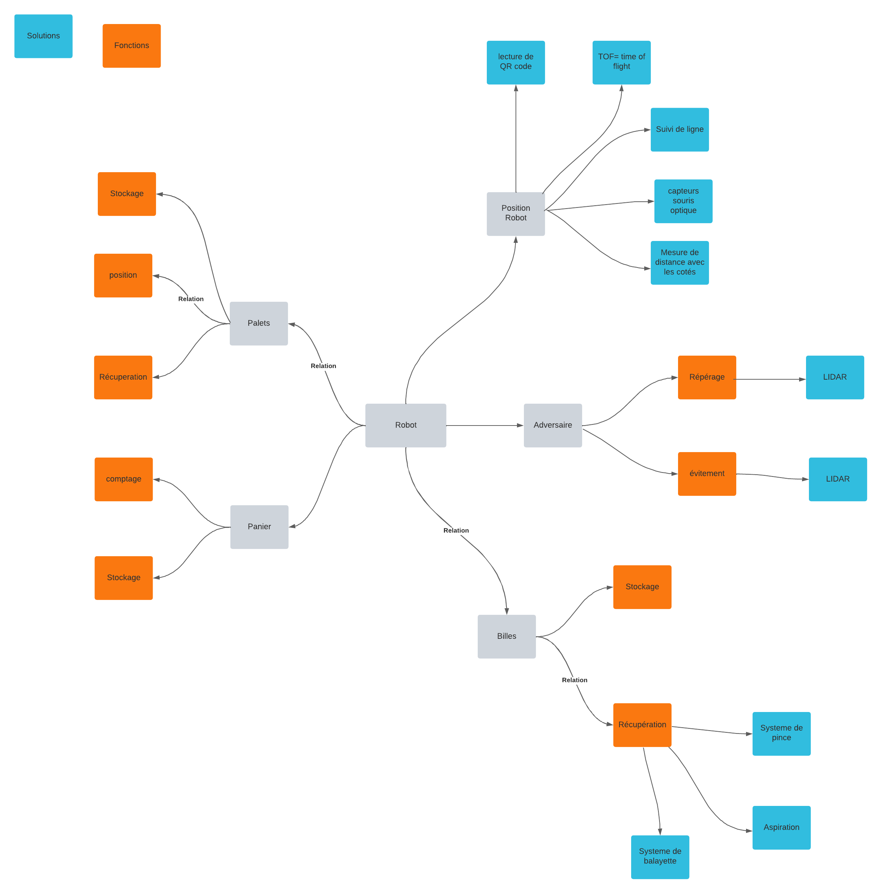

# Coupe de France de Robotique 20233

## I/ Objectif de la coupe et objectif de l'équipe

## II/ Conception du Robot

    
    <figcaption>Conception du Robot</figcaption>

### **Base roulante**
#### Moteurs DC
#### Suivi de ligne
#### Roues encodeuse

### **Vision**
#### LIDAR
#### ToF

### **Récupération d'objet**
#### Palets
#### Billes

### **Panier**
 
## III/ Contributeurs
- Arnaud (4ETI - ROSE)
- Theotime (4ETI - ROSE)
- Louis Robert (3ETI)
- Antoine Languille (4ETI - ESE)
- Alix Deleule (4ETI - ROSE)
- Augustin Laprais (4ETI - ESE)
- Audrey Nicolle (4ETI - ESE)
- Mathieu Zeman (4ETI - IMI)