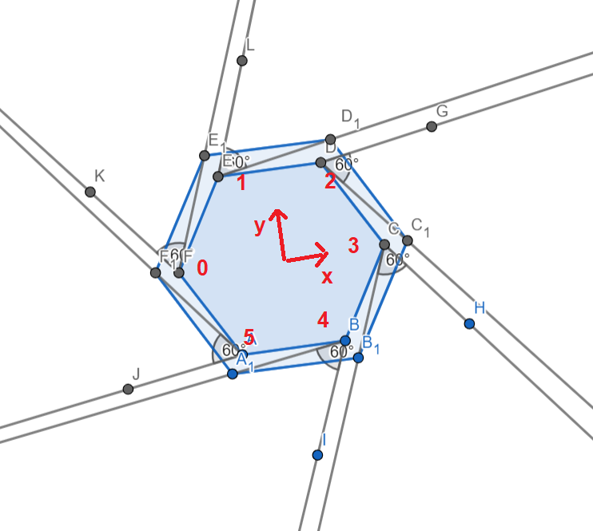
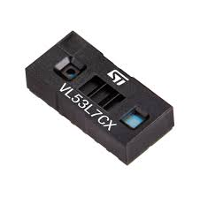
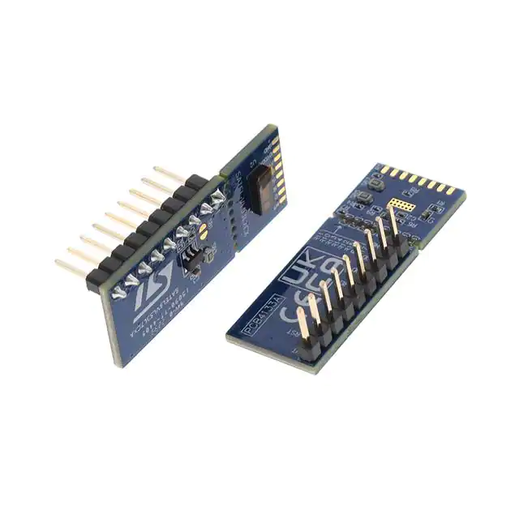
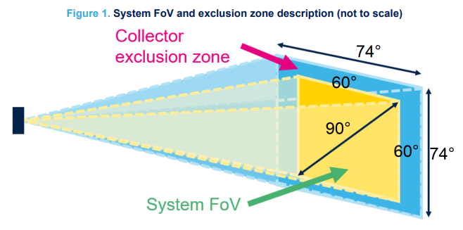
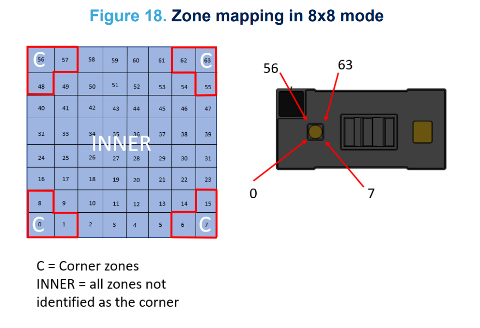

# Galileo
Ce repertoire contient le code de dévelopement de la partie basse de la vision du robot pour la coupe de France de Robotique.

Pour la vision nous superposons les points obtenues par un LIDAR(partie haute) et les points obtenues par le ALIDARX(partie basse).

## **Le ALIDARX**
Le ALIDARX est composé de 6 ToF(Time of Flight) ici des `VL53L7CX` et d'une `STM32-F401RE`.

Les ToF sont disposés sur le robot de façon à couvrir 360°.

    
    <figcaption>Disposition des ToF sur le robot</figcaption>

### **Capteur VL53L7CX**

    
    

Le capteur de distance multi-zone 8x8 à temps de vol (Time-of-Flight) avec un champ de vision de 90° est un type de capteur qui utilise le principe de temps de vol pour calculer la distance et la position.

|Caractéristique||
| - | - | 
| Champ de vision (FoV) | 60° x 60° (90° diagonale)|
| Multizone ranging output | 4x4 ou 8x8 |
| Distance de mesure | 2 à 350 cm |
| Détection multi-cible |
| Interface I2C | Bus série, addresse: 0x52 |
| Fréquence de trame maximum| 60 Hz |
| Fréquence infrarouge | 940 nm |
| Température de fonctionnement | -30 to 85 °C |

    
    <figcaption>Zone Mapping 8x8</figcaption>

